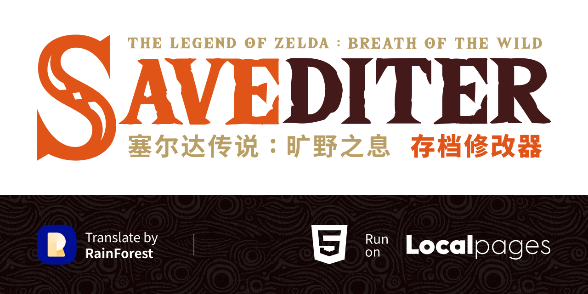

# Botw-Savediter-Local
塞尔达传说：旷野之息 游戏存档修改器的本地单文件版本  
本来想打包 App 的，但是发现再怎么压缩文件都很大，不如就单个页面文件吧。没有把 [css] 和 [js] 等等 都放到本地是因为后期更新不太方便。这样一个单html文件直接放在 [mlc1] 根目录去，使用起来也比较简单。

----

*tips：这个本地版的，主要是为了解决一个痛点，就是存档编号的问题，以往需要对照着图片确认是哪个存档。但现在这个但文件版本可以获取到存档的截图直接列出来，并标注上编号。方便确认那个是你需要修改的。*

### 在线版本
     
[Botw-Savediter](https://kailous.github.io/Botw-Savediter/) | [Goto Github](https://github.com/kailous/Botw-Savediter)
